<p align="center">
  
</p>

<p align="center">
  
</p>

```bash
$ whoami
dogukan · software engineer from turkey
builds games, AI tools and full-stack apps

$ cat now.txt
📡 building    TelecomEmpire, a telecom tycoon game
🧠 exploring   AI-driven CPU scheduling
🧪 testing     everything, with Playwright
```

### ⚡ featured builds

| | Project | What it does | Built with |
|:-:|---|---|---|
| 📡 | **[TelecomEmpire](https://github.com/Dgkann/TelecomEmpire)** | Tycoon strategy game: bid for spectrum, wire up cities, outplay rival carriers | React · TypeScript · Zustand |
| 🧠 | **[AI-OS Scheduler](https://github.com/XFGQ/AI-Driven-Energy-Efficient-Scheduler-for-Heterogeneous-P-E-Core-Architectures)** | A deep learning model picks P-cores or E-cores in real time to cut energy use | Python · TensorFlow · PyQt5 |
| 🏔️ | **[Aktour ViaBalkan](https://github.com/XFGQ/Aktourbosna-Management-System)** | Management system for a real Balkan tour company, auto-deployed to our own rack server | Java 21 · Spring Boot · JavaFX |
| 🐾 | **[AdoptaFriend](https://github.com/Dgkann/adoptafriend)** | Helps shelter animals find homes with adoption, volunteering and donations | Next.js · Tailwind |
| 🧪 | **[OLX.ba Test Suite](https://github.com/XFGQ/OLX-Website-Testing)** | Functional and smoke tests for OLX.ba | Playwright · TypeScript |

### 🛠️ toolbox

<p align="center">
  
</p>

### 🐍 contribution snake

<picture>
  <source media="(prefers-color-scheme: dark)" srcset="https://raw.githubusercontent.com/Dgkann/Dgkann/output/snake-neon.svg"/>
  
</picture>

### 🎲 roll the dice

A multiplayer version of my [Dicegame](https://github.com/Dgkann/Dicegame), played right here. Every roll adds to a shared pot, a **1** wipes it, and whoever pushes it to **100** enters the hall of fame.

<!-- DICE:START -->
<div align="center">


**[@Dgkann](https://github.com/Dgkann) rolled a 3**

`▱▱▱▱▱▱▱▱▱▱` **3 / 100**

recent rolls: [@Dgkann](https://github.com/Dgkann) `3`<br/>
🏆 hall of fame: nobody yet<br/>
<sub>total rolls: 1</sub>

</div>
<!-- DICE:END -->

<p align="center">
  <a href="https://github.com/Dgkann/Dgkann/issues/new?title=%F0%9F%8E%B2%20roll&body=Just%20press%20Create.%20The%20bot%20rolls%20for%20you%20and%20the%20result%20shows%20up%20on%20the%20profile%20in%20about%2030%20seconds."></a>
</p>

<p align="center">
  
</p>
