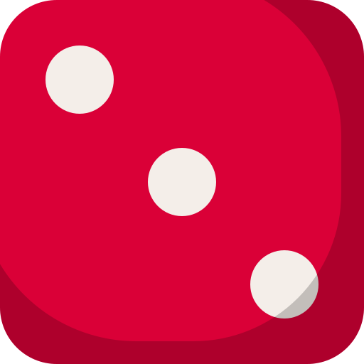

<p align="center">
  
</p>

Hi, I'm Doğukan

I'm a Software Engineering student who likes learning by building things.

I'm interested in **frontend, backend, cloud and network technologies**. I enjoy understanding how a system works, not only writing the code.

I work with technologies like **React, TypeScript, Node.js, PostgreSQL and Docker**, and I'm also learning more about **telecom networks, monitoring and cloud systems**.

Outside of coding, I enjoy **gaming, cars, travelling, music and football**. I also like trying new technologies and working on small ideas that come to my mind.

I don't want to stay in only one area. I like learning different parts of technology and improving myself step by step.

```text
$ traceroute core-network-engineer
traceroute to core-network-engineer (10.0.0.1), 30 hops max, 60 byte packets
 1  final-year.swe-student (192.168.1.1)  0.412 ms  0.388 ms  0.401 ms
 2  react.node.postgres.docker (172.16.0.1)  3.870 ms  3.912 ms  3.855 ms
 3  telecomempire.game (172.16.3.7)  8.214 ms  8.190 ms  8.301 ms
 4  cnf-onboarding.vodafone (10.20.4.1)  12.906 ms  13.011 ms  12.877 ms
 5  ccna.aws.in-progress (10.20.5.1)  21.337 ms *  22.104 ms
 6  * * *
```

### Projects

- **CNF Onboarding Platform** (private): web app for tracking CNF onboarding, built for Vodafone. React, TypeScript.
- **[TelecomEmpire](https://github.com/Dgkann/TelecomEmpire)**: telecom tycoon game. React, TypeScript.
- **[GroundControl](https://github.com/ORAO-AVIATION-IUS/GroundControl)**: drone ground control station for ORAO Aviation, with MAVLink telemetry. C++, Qt/QML.
- **[Aktour ViaBalkan](https://github.com/XFGQ/Aktourbosna-Management-System)**: tour management system for a travel company in Bosnia. Spring Boot, JavaFX.
- **[AI-OS Scheduler](https://github.com/XFGQ/AI-Driven-Energy-Efficient-Scheduler-for-Heterogeneous-P-E-Core-Architectures)**: AI model that picks P-cores or E-cores to save energy. Python, TensorFlow.
- **[OLX.ba tests](https://github.com/XFGQ/OLX-Website-Testing)**: Playwright tests for OLX.ba.

### Tech

**Frontend**<br/>


**Backend and data**<br/>


**Cloud and tools**<br/>


Also: Playwright, Zustand, TanStack Query, ECharts, Spring Security, JavaFX, PyQt5, MAVLink

<picture>
  <source media="(prefers-color-scheme: dark)" srcset="https://raw.githubusercontent.com/Dgkann/Dgkann/output/snake-neon.svg"/>
  
</picture>

### Roll the dice

Everyone who visits this page shares one pot. Hit the button, press Create on the issue that opens, and a bot rolls for you. Each roll adds to the pot, a 1 wipes it for everyone, and whoever pushes it to 100 gets their name in the hall of fame. The rules come from my [Dicegame](https://github.com/Dgkann/Dicegame).

<!-- DICE:START -->
<div align="center">



**[@Dgkann](https://github.com/Dgkann) rolled a 3**

`▱▱▱▱▱▱▱▱▱▱` **3 / 100**

recent rolls: [@Dgkann](https://github.com/Dgkann) `3`<br/>
🏆 hall of fame: nobody yet<br/>
<sub>total rolls: 1</sub>

</div>
<!-- DICE:END -->

<p align="center">
  <a href="https://github.com/Dgkann/Dgkann/issues/new?title=%F0%9F%8E%B2%20roll&body=Just%20press%20Create.%20The%20bot%20rolls%20for%20you%20and%20the%20result%20shows%20up%20on%20the%20profile%20in%20about%2030%20seconds."></a>
</p>
